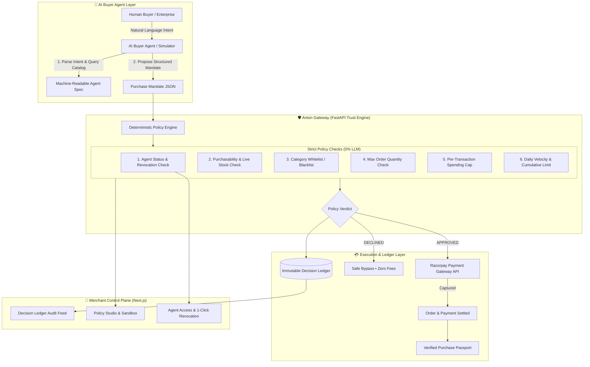

# 🛡️ Anton — Autonomous Commerce Trust Gateway
> **Razorpay Hackathon • Track 01: AI Growth & Agentic Commerce**  
> *A merchant-side authorization, policy bounding, and audit gateway enabling Razorpay merchants to safely transact with autonomous AI buyers.*

---

```
             ┌─────────────────────────────────────────────────────────────┐
             │                     THE GATEWAY LAW                         │
             │                                                             │
             │   "AI proposes. Policy decides. Razorpay executes.          │
             │    The ledger remembers. The buyer understands.             │
             │    The merchant stays in control."                          │
             └─────────────────────────────────────────────────────────────┘
```

---

## 📌 Table of Contents
1. [The Problem: Why Autonomous Commerce Breaks Today](#-the-problem-why-autonomous-commerce-breaks-today)
2. [The Solution: What Anton Does](#-the-solution-what-anton-does)
3. [Why Anton & Why It Is 10x Better](#-why-anton--why-it-is-10x-better)
4. [System Architecture & Design](#-system-architecture--design)
5. [Core Components](#-core-components)
6. [The 5-Step Gateway Lifecycle](#-the-5-step-gateway-lifecycle)
7. [Tech Stack](#-tech-stack)
8. [Getting Started & Installation](#-getting-started--installation)
9. [Interactive Demo Benchmark Scenarios](#-interactive-demo-benchmark-scenarios)
10. [API Reference & JSON Schema](#-api-reference--json-schema)

---

## 🚨 The Problem: Why Autonomous Commerce Breaks Today

As consumers and enterprises deploy autonomous AI agents (e.g., procurement bots, personal assistants, auto-restock agents) to shop on the web, commerce infrastructure encounters five catastrophic vulnerabilities:

| # | Vulnerability | The Fatal Flaw in Existing Systems | Real-World Failure Example |
|---|---|---|---|
| **1** | **LLM Price & Stock Hallucination** | Standard LLM agents make assumptions about product discounts, specs, or stock availability. | Agent buys an out-of-stock monitor based on stale training data or invented coupons. |
| **2** | **Inversion of Financial Authority** | Giving an LLM raw API keys or checkout credentials allows probabilistic code to make financial decisions. | A prompt injection or hallucinated loop orders 50 laptops instead of 1, draining company credit. |
| **3** | **Zero Merchant Governance** | Merchants have no way to establish rules specifically for autonomous bots (velocity, caps, prohibited categories). | A bot wipes out flash-sale inventory in 100ms or buys restricted high-liability items. |
| **4** | **Rogue & Malicious Agents** | Once an agent is authenticated, there is no instant revocation mechanism to freeze its autonomous spending. | A compromised agent continues executing transactions unnoticed for days. |
| **5** | **Buyer Post-Purchase Disconnect** | Humans have zero visibility into *why* an AI agent selected Product A over Product B, or what trade-offs were made. | Buyer receives an unexpected item and issues a chargeback, hurting merchant reputation. |

---

## 💡 The Solution: What Anton Does

**Anton** is a high-performance **Merchant-Side Authorization and Trust Gateway** built between external AI buyers and Razorpay checkout APIs. 

Anton introduces a strict separation of concerns:
* **The AI Agent’s Role**: Discover products via machine-readable JSON specs, score candidates, and propose a structured **Purchase Mandate**.
* **The Gateway’s Role (Anton)**: Evaluates the mandate against **100% deterministic, server-side merchant policies** (velocity limits, budget ceilings, category whitelists, agent status).
* **Razorpay’s Role**: Executes order creation and payment capture **only after cryptographic/policy clearance**. If a mandate is declined, Razorpay is never invoked.
* **The Audit Layer**: Produces an immutable **Decision Ledger** and issues a transparent, human-readable **Purchase Passport** to the buyer.

---

## ⚡ Why Anton & Why It Is 10x Better

```
┌──────────────────────────────────────┐     ┌──────────────────────────────────────┐
│       TRADITIONAL BOT COMMERCE       │     │            ANTON GATEWAY             │
├──────────────────────────────────────┤     ├──────────────────────────────────────┤
│ ❌ LLM decides if money moves        │     │ ✅ Policy engine decides money moves │
│ ❌ Direct credential access to card  │     │ ✅ Zero financial authority for LLMs │
│ ❌ Opaque black-box reasoning        │     │ ✅ Grounded Purchase Passport issued │
│ ❌ No merchant spending bounds       │     │ ✅ Real-time caps, velocity & quotas │
│ ❌ Irrevocable once authenticated    │     │ ✅ 1-click instant agent revocation  │
│ ❌ Razorpay called unconditionally   │     │ ✅ Razorpay called ONLY if cleared   │
└──────────────────────────────────────┘     └──────────────────────────────────────┘
```

1. **Zero LLM Authority on Money**: Prompts and language models **never** touch payment authorization. The policy engine runs deterministically in pure Python/FastAPI code.
2. **Grounded Multi-Candidate Scoring**: Evaluates the merchant's live catalog, scoring attribute matches, promotional deals, and trade-offs before constructing a mandate.
3. **Pre-Payment Enforcement**: Eliminates payment gateway transaction fees on invalid, rogue, or out-of-policy agent requests.
4. **Autonomous Purchase Passport**: A verifiable receipt detailing all evaluated candidates, the exact policy rules passed, and the Razorpay settlement signature.

---

## 🏛️ System Architecture & Design

### High-Level Visual Architecture Diagram

```
┌────────────────────────────────────────────────────────────────────────────────────────┐
│                               🤖 AI BUYER AGENT LAYER                                  │
│                                                                                        │
│   Human / Procurement Bot                                                             │
│             │                                                                          │
│             ▼                                                                          │
│   [ Natural Language Intent ] ───► [ JSON Catalog Query ] ───► [ Candidate Matcher ]   │
│                                                                         │              │
│                                                                         ▼              │
│                                                            [ Proposed Mandate JSON ]   │
└───────────────────────────────────────────┬────────────────────────────────────────────┘
                                            │
                                            ▼ (POST /api/mandate/evaluate)
┌────────────────────────────────────────────────────────────────────────────────────────┐
│                       🛡️ ANTON GATEWAY (POLICY TRUST ENGINE)                           │
│                                                                                        │
│   ┌────────────────────────────────────────────────────────────────────────────────┐   │
│   │                 DETERMINISTIC RULE ENGINE (100% Code • 0% LLM)                 │   │
│   │                                                                                │   │
│   │  [Rule 1] ──► Agent Status & Revocation Check (Is Token Active / Non-Rogue?)   │   │
│   │  [Rule 2] ──► Purchasability & Live Stock Check (Stock >= Requested Quantity?) │   │
│   │  [Rule 3] ──► Category Whitelist Check (Is Category in Allowed List?)          │   │
│   │  [Rule 4] ──► Max Order Quantity Cap (Quantity <= Policy Order Cap?)           │   │
│   │  [Rule 5] ──► Transaction Spending Cap (Total Price <= Max Autonomous Cap?)    │   │
│   │  [Rule 6] ──► Daily Cumulative Velocity Check (Today Spend <= Daily Cap?)      │   │
│   └───────────────────────────────────────┬────────────────────────────────────────┘   │
│                                           │                                            │
│                                           ▼                                            │
│                              [ Policy Verdict Decision ]                               │
│                                   /                \                                   │
│                        APPROVED  /                  \  DECLINED                        │
└─────────────────────────────────┬────────────────────┴─────────────────────────────────┘
                                  │                    │
              ┌───────────────────┘                    └───────────────────┐
              ▼                                                            ▼
┌───────────────────────────┐                            ┌───────────────────────────┐
│   💳 RAZORPAY EXECUTION   │                            │   🛑 SAFE BYPASS LAYER    │
│                           │                            │                           │
│ • Create Razorpay Order   │                            │ • Zero Gateway Invocation │
│ • Capture Payment Token   │                            │ • Zero Transaction Fees   │
│ • Settle Merchant Balance │                            │ • Provide Remediation Info│
└─────────────┬─────────────┘                            └─────────────┬─────────────┘
              │                                                        │
              └───────────────────────────┬────────────────────────────┘
                                          │
                                          ▼
┌────────────────────────────────────────────────────────────────────────────────────────┐
│                        📜 IMMUTABLE AUDIT & TRUST LAYER                                │
│                                                                                        │
│      ┌─────────────────────────────┐           ┌─────────────────────────────┐         │
│      │   DECISION LEDGER (Audit)   │           │  PURCHASE PASSPORT (Buyer)  │         │
│      │                             │           │                             │         │
│      │ • Full Rule Evaluation Log  │           │ • Selected Product Specs    │         │
│      │ • Merchant Policy Snapshot  │           │ • Multi-Candidate Evidence  │         │
│      │ • Razorpay Transaction IDs  │           │ • Trade-off Explanations    │         │
│      │ • Timestamped State Vector  │           │ • Verified Authorization    │         │
│      └──────────────┬──────────────┘           └─────────────────────────────┘         │
└─────────────────────┼──────────────────────────────────────────────────────────────────┘
                      │
                      ▼
┌────────────────────────────────────────────────────────────────────────────────────────┐
│                      🏬 MERCHANT CONTROL PLANE (Next.js 16 UI)                         │
│                                                                                        │
│   [ KPI Dashboard ]  •  [ Policy Studio ]  •  [ Ledger Feed ]  •  [ Agent Access ]    │
└────────────────────────────────────────────────────────────────────────────────────────┘
```

<details>
<summary><b>📊 Click to expand Mermaid Diagram source</b></summary>


</details>

---

## 🧩 Core Components

### 1. Agent Spec & Catalog Engine (`/api/catalog/agent-spec`)
* Exposes a structured JSON format optimized for AI agents.
* Contains full attribute definitions, real-time stock levels, `agent_purchasable` flags, and promotional `deal_tags`.

### 2. Candidate Evaluator & Intent Parser (`/api/intent/evaluate`)
* Extracts structured procurement intents (budget ceiling, required specs, desired quantity).
* Performs vector/attribute matching over catalog products.
* Computes match scores (`0-100%`), detects trade-offs, and selects the optimal candidate.

### 3. Deterministic Policy Engine (`/api/mandate/evaluate`)
* **100% deterministic rule engine**.
* Evaluates 6 critical boundary checks:
  1. `AGENT_ACTIVE_CHECK`: Ensures agent token is not revoked or suspended.
  2. `AGENT_PURCHASABLE_CHECK`: Verifies item is authorized for autonomous bots.
  3. `STOCK_AVAILABILITY_CHECK`: Confirms inventory meets requested quantity.
  4. `CATEGORY_ALLOWANCE_CHECK`: Enforces merchant-allowed category list.
  5. `TRANSACTION_LIMIT_CHECK`: Validates order total against per-transaction cap.
  6. `DAILY_SPEND_LIMIT_CHECK`: Validates cumulative agent velocity for the current date.

### 4. Razorpay Execution Adapter (`/api/payments/razorpay/create-order`)
* Safe abstraction over the Razorpay Orders & Payments API.
* **Hard Rule**: Razorpay is only invoked after the policy engine returns `APPROVED`.

### 5. Immutable Decision Ledger (`/api/ledger`)
* Comprehensive audit trail storing timestamp, buyer prompt, agent identity, rules evaluated, verdict, and payment IDs.

### 6. Grounded Purchase Passport (`/api/passport/{id}`)
* Verifiable post-purchase document issued to the buyer, explaining candidate selection rationale, policy clearance, and Razorpay confirmation.

---

## 🔄 The 5-Step Gateway Lifecycle

```
[ Step 01: INTENT ]
  User Prompt ➔ "Find ANC headphones under ₹5,000 with good battery life and buy them"
        │
        ▼
[ Step 02: DISCOVERY & SCORING ]
  Agent scans Catalog ➔ Top Match: Boat Nirvana 751 ANC (96% Match, ₹3,999)
        │
        ▼
[ Step 03: MANDATE PROPOSAL ]
  Structured Mandate: { Agent: "agent_42", Product: "prod_boat_anc", Qty: 1, MaxCap: ₹5,000 }
        │
        ▼
[ Step 04: POLICY ENGINE AUTHORIZATION ]
  Deterministic Evaluation:
  ✓ Agent Active (PASS)
  ✓ Item Purchasable & In Stock (PASS)
  ✓ Allowed Category: Electronics (PASS)
  ✓ Amount ₹3,999 <= Cap ₹50,000 (PASS)
  ✓ Daily Cumulative Limit (PASS)
  ➔ Verdict: APPROVED
        │
        ▼
[ Step 05: RAZORPAY EXECUTION & PASSPORT ]
  Razorpay Order Created: order_Q8s7X9... ➔ Payment Captured: pay_K3m2...
  ➔ Grounded Purchase Passport Issued to Buyer
```

---

## 💻 Tech Stack

### Frontend Application
* **Framework**: Next.js 16 (React 19 App Router with Turbopack)
* **Styling**: Tailwind CSS with custom **Linear-Style Soft Light Mode** & **Vercel Pure Dark Mode**
* **Icons & UI**: Lucide React, responsive skeletons, micro-animations
* **State & Networking**: Native Fetch API client with TypeScript interfaces

### Backend API & Policy Gateway
* **Framework**: FastAPI (Python 3.11)
* **Validation & Schemas**: Pydantic v2
* **Storage**: SQLite & In-Memory JSON Ledger with persistent file fallback
* **Payment Provider**: Razorpay Python SDK (with sandbox mock fallbacks)
* **Testing**: Pytest automated test suite (100% pass rate)

---

## 🚀 Getting Started & Installation

### Prerequisites
* **Node.js**: v18.17+ or v20+
* **Python**: v3.10+ or v3.11+
* **Package Managers**: `npm` and `pip`

---

### Step 1: Clone the Repository
```bash
git clone https://github.com/your-username/anton-agent-gateway.git
cd anton-agent-gateway
```

---

### Step 2: Backend Setup
```bash
cd backend

# Create virtual environment (optional but recommended)
python -m venv venv
# Windows:
venv\Scripts\activate
# Linux/macOS:
# source venv/bin/activate

# Install dependencies
pip install -r requirements.txt

# Run automated test suite to verify policies
pytest tests/test_gateway.py -v

# Start the FastAPI server
python run.py
```
* Backend runs at: `http://127.0.0.1:8000`
* Interactive OpenAPI Docs at: `http://127.0.0.1:8000/docs`

---

### Step 3: Frontend Setup
Open a new terminal window:
```bash
cd frontend

# Install dependencies
npm install

# Start development server
npm run dev
```
* Frontend application runs at: `http://localhost:3000`

---

## 🧪 Interactive Demo Benchmark Scenarios

The simulator includes 4 pre-built benchmark scenarios accessible with 1-click:

| Scenario | Input Prompt | Target Agent | Expected Gateway Verdict | Policy Mechanism Tested |
|---|---|---|---|---|
| **Scenario A** | *"Find me the best ANC headphones under ₹5,000 with good battery life and buy them"* | `agent_42` (Active) | **APPROVED & PAID** | Normal autonomous path. Evaluates 12 products, selects top candidate, passes all 6 policy checks, captures Razorpay payment, issues Purchase Passport. |
| **Scenario B** | *"Buy 3 of the 4K UHD monitors for our design workstation setup"* | `agent_42` (Active) | **DECLINED** | Transaction Spending Cap. Total ₹74,997 exceeds max per-transaction policy limit of ₹50,000. Razorpay is safely bypassed. |
| **Scenario C** | *"Purchase an Acme Corporate Gift Voucher for ₹50,000"* | `agent_42` (Active) | **DECLINED** | Prohibited Category. `Gift Cards / Vouchers` category is blocked by merchant policy. |
| **Scenario D** | *"Find me a GaN fast charging station under ₹3,000"* | `agent_rogue` (Revoked) | **DECLINED** | Instant Agent Revocation. `agent_rogue` was revoked by merchant. Rule 1 immediately rejects the mandate. |

---

## 📡 API Reference & JSON Schema

### 1. Catalog Agent Spec
```http
GET /api/catalog/agent-spec
```
**Response (Sample)**:
```json
{
  "merchant": "Acme Electronics & Lifestyle Store",
  "version": "1.0.0",
  "total_items": 12,
  "currency": "INR",
  "items": [
    {
      "id": "prod_boat_anc",
      "name": "Boat Nirvana 751 ANC Wireless",
      "category": "Electronics",
      "price": 3999.0,
      "stock": 14,
      "agent_purchasable": true,
      "deal_tag": "⚡ ₹500 OFF with code AGENT500",
      "attributes": {
        "type": "Over-Ear",
        "anc": true,
        "battery_life": "65 hours",
        "connectivity": "Bluetooth 5.0"
      }
    }
  ]
}
```

---

### 2. Intent Evaluation
```http
POST /api/intent/evaluate
```
**Request**:
```json
{
  "prompt": "Find ANC headphones under ₹5,000 with good battery life",
  "agent_id": "agent_42"
}
```

---

### 3. Mandate Authorization
```http
POST /api/mandate/evaluate
```
**Request**:
```json
{
  "agent_id": "agent_42",
  "product_id": "prod_boat_anc",
  "quantity": 1,
  "max_budget": 5000.0,
  "buyer_prompt": "Find ANC headphones under ₹5,000",
  "selection_rationale": "Selected Boat Nirvana 751 ANC (96% match, ₹3,999) under ₹5,000 budget cap."
}
```
**Response**:
```json
{
  "mandate_id": "mand_8f92a1...",
  "decision": "APPROVED",
  "decision_reason": "All 6 merchant policy rules passed.",
  "rules_evaluated": [
    { "rule": "AGENT_ACTIVE_CHECK", "passed": true, "detail": "Agent agent_42 is ACTIVE and verified." },
    { "rule": "AGENT_PURCHASABLE_CHECK", "passed": true, "detail": "Product is purchasable by autonomous agents." },
    { "rule": "STOCK_AVAILABILITY_CHECK", "passed": true, "detail": "Stock available (14 units) >= requested (1 unit)." },
    { "rule": "CATEGORY_ALLOWANCE_CHECK", "passed": true, "detail": "Category 'Electronics' is in allowed merchant whitelist." },
    { "rule": "TRANSACTION_LIMIT_CHECK", "passed": true, "detail": "Order total ₹3,999 <= max autonomous limit ₹50,000." },
    { "rule": "DAILY_SPEND_LIMIT_CHECK", "passed": true, "detail": "Total spend today ₹3,999 <= daily cap ₹100,000." }
  ]
}
```

---

## 👥 Team & Submission
* **Project**: Anton — Agent Commerce Gateway
* **Track**: Razorpay Track 01 — AI Growth & Agentic Commerce
* **License**: MIT License
